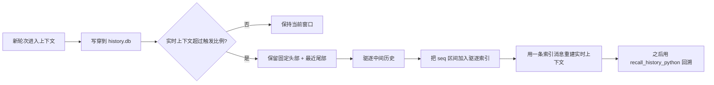

# 上下文管理（Context Management）

## 概述

QwenPaw 当前默认的上下文策略是 **scroll**：旧轮次不会被总结后丢弃，而是先写入持久化 SQLite 历史库；当模型窗口接近上限时，再把中间历史从实时上下文中驱逐出去，并用一条紧凑的上下文内索引表示。之后 Agent 可以按需把原始历史读回来。

旧的 AgentScope 原生压缩路径仍然可用，配置 `strategy: "native"` 即可切回；新配置默认使用 `strategy: "scroll"`。

## 三种记忆系统

QwenPaw 把记忆组织为三套互补的系统——工作记忆（Working）、情景记忆（Episodic）和语义记忆（Semantic）——大致对应人类记忆，每套由不同子系统负责：

| 记忆系统     | 是什么                                                                               | 文档                    |
| ------------ | ------------------------------------------------------------------------------------ | ----------------------- |
| **工作记忆** | 实时的提示词窗口。较早的轮次被驱逐成一份紧凑、可展开的索引——从不总结。               | [上下文管理](./context) |
| **情景记忆** | 跨会话、逐字的持久记录，通过 `recall_history_python` 按需取回。                      | [上下文管理](./context) |
| **语义记忆** | 提炼后的事实、偏好与知识；ReMe 把每日记忆沉淀进 `digest/`，用 `memory_search` 检索。 | [长期记忆](./memory)    |

其中 **工作记忆** 与 **情景记忆** 由 **scroll** 上下文管理器（`ScrollContextManager`）实现；**语义记忆** 由 **ReMe** 实现。三者刻意保持正交：scroll 逐字保留原始历史、从不总结，而 ReMe 提炼可复用知识、从不触碰实时窗口或逐字历史库。

> **本页讲的是工作记忆与情景记忆**——即 scroll 上下文管理器。语义记忆（ReMe 长期记忆后端）请通过上方链接查看。

## Scroll 工作方式



核心特性：

- **先持久化**：`ScrollContextManager` 在任何驱逐前，都会先把实时上下文写入 `{working_dir}/history.db`。
- **不依赖摘要**：被驱逐的内容由 `EvictionIndex` 表示，而不是由 LLM 生成一段压缩摘要。
- **可回溯原文**：索引中的每一行都带 `seq` 区间。Agent 可以调用 `recall_history_python`，再用 `ms.expand(lo, hi)` 读取完整原始记录。
- **跨会话历史**：历史行包含 `session_id` 和 `agent_id`，默认可检索当前 Agent 的所有历史会话；显式放宽时也能查询同一工作区内其他 Agent 的历史。
- **安全降级**：如果 scroll 无法构建，或 recall 工具无法安全运行，QwenPaw 会退回 native 上下文管理，避免把历史驱逐到无法读取的位置。

## 存储布局

| 路径                                    | 默认值                                          | 用途                                                            |
| --------------------------------------- | ----------------------------------------------- | --------------------------------------------------------------- |
| `{working_dir}/history.db`              | `scroll_config.db_filename = "history.db"`      | 主要持久化 SQLite 历史库，是 scroll recall 的真相来源。         |
| `{working_dir}/dialog/YYYY-MM-DD.jsonl` | 可选                                            | `scroll_config.offload_dialog = true` 时写入的旧版 JSONL 归档。 |
| `{working_dir}/tool_results/`           | `tool_result_pruning_config.tool_results_cache` | 旧版分层工具结果裁剪中间件使用的文件缓存。                      |

`history.db` 中的核心表是 `conversation_history`：

| 字段                                            | 含义                                                    |
| ----------------------------------------------- | ------------------------------------------------------- |
| `seq`                                           | 全局递增地址，驱逐索引和 recall helper 都用它定位历史。 |
| `session_id`, `agent_id`                        | 会话与 Agent 归属。                                     |
| `kind`                                          | `model_turn`、`context_msg` 或 `tool_result`。          |
| `role`, `name`, `content`                       | 角色/工具元数据以及可搜索的扁平文本。                   |
| `tool_call_id`, `tool_input`, `tool_state`      | 工具调用关联、参数和结果状态。                          |
| `headline`                                      | 模型主动写入的里程碑标题，用作驱逐索引叶子。            |
| `blocks`, `metadata`, `created_at`, `dedup_key` | 完整序列化块、元数据、时间戳和幂等键。                  |

如果当前 SQLite 支持 FTS5，QwenPaw 会维护 `conversation_history_fts` 全文索引；否则 `ms.search` 会降级为较慢的 `LIKE` 扫描。

## 工作记忆（Working Memory）

**工作记忆** 就是实时的提示词窗口——模型此刻能看到的内容。窗口写满时，scroll 把较早的轮次驱逐成一份紧凑、可展开的索引，而不是总结后丢弃，从而把窗口控制在预算内；索引的每个条目，就是模型在那一轮写下的一行 **headline（里程碑标题）**。下面先讲 headline 怎么来，再讲实时窗口如何重建、驱逐索引如何分层。

### Headlines（里程碑标题）

scroll 的核心设计是：**不靠模型生成摘要来压缩上下文**。取而代之，模型自己标记里程碑——在每一轮有价值的回答结束时（确立了某个事实或数值、做出或修改了决定、得到结果、完成步骤、或撞上不值得重蹈的死胡同），写下一行简短的里程碑标题。它以行尾、单独一行的 HTML 注释给出，并用一对 **稀有字符 ` … `** 包裹：

```text
<!--  决定用 PostgreSQL 替换 MySQL（需要 JSONB 支持）  -->
```

- **怎么被收录**：scroll 把这一行抽进该轮的 `headline` 字段（仅模型 / assistant 轮次），并把这条注释从渲染给聊天界面的内容里删掉——所以它对用户不可见，但在持久行里原样保留。
- **作用**：当上下文被压缩、原始轮次被驱逐出实时窗口后，这条 headline 正是仍然保留在上下文里的关键信息——用它，而不是用模型写的摘要。被存下的 headline 之后会成为下面驱逐索引里该轮的 `seq ·  … ` 叶子。

### 实时上下文结构

发生驱逐后，实时上下文会被重建为：

```text
固定头部
  通常是第一条用户任务，由 scroll_config.pinned 控制。

驱逐索引（名为 "memory" 的占位消息）
  scroll 注入的一条合成消息（不是真实对话轮次），代表所有被驱逐的轮次，
  装着整份驱逐索引：以 [context compressed] 开头，后面是分层的 headline
  与 seq 区间，以及如何用 recall 取回原文的说明。详见下一节「驱逐索引」。

最近尾部
  由 AgentScope 的配对安全切分逻辑选出的最新轮次。
```

切分使用 AgentScope 的 token 统计和配对安全压缩 helper，因此会尽量保持实时窗口边界上的 tool_call / tool_result 对齐。

### 驱逐索引

驱逐索引是工作记忆的核心：一份保留在上下文里的历史地图，让实时窗口保持精简，同时随时可展开。它采用分层结构：

- **Tier 0** 保存最近被驱逐的块，细节最多。
- 更老的 Tier 会把旧块折叠成端点区间。
- 每一行仍然带 `seq` 或 `seq lo-hi` 区间，因此即便折叠后也能从 `history.db` 展开原文。

示例形态：

```text
<system-info>
[context compressed] The turns below were evicted ...

Re-expand a span inside recall_history_python: ms.expand(lo, hi)

===== Tier 1 (older msgs) =====
  [seq 10-80]
    · seq 10-34   chose SQLite history store - added recall tool 
===== Tier 0 (recently compressed) =====
  [seq 81-96]
    · seq 84   implemented context builder wiring 
    · seq 93   verified fallback to native strategy 
</system-info>
```

索引里每个 ` … ` 叶子，就是上一节那条由模型写下的 headline。模型不应该只凭 headline 回答：headline 只是指针；真正证据应来自 `ms.expand`、`ms.search` 或其他 recall helper 返回的完整内容。

## 情景记忆（Episodic Memory）

**情景记忆** 是 Agent 说过、做过的一切的持久、逐字记录——写入 `history.db`，跨所有会话按需取回。工作记忆从实时窗口驱逐掉的内容不会丢失，都精确、可检索地留在这里。下面几节分别讲如何取回它、超长工具结果如何卸载进来，以及旧会话如何在启动时迁移进来。

### Recall API

Recall API 是情景记忆的接口：把工作记忆驱逐后留下的、持久且逐字的历史读回来。scroll 启用时，QwenPaw 会注入一个支持沙箱运行的工具：`recall_history_python`。Python cell 中已经定义好 `ms`，它是一个 `MemorySpace` 对象。

常用 helper：

```python
# 展开索引中的区间。
print(ms.expand(81, 96))

# 搜索当前 Agent 跨会话的持久历史。
hits = ms.search("deployment decision", k=20)
for row in hits:
    print(row["seq"], row["session_id"], row["content"][:500])

# 读取某次工具调用及其结果。
print(ms.recall_tool("tool-call-id"))

# 发现并读取会话。
print(ms.sessions())
print(ms.session("cron:nightly-report"))

# 明确需要时查看工作区内 Agent。
print(ms.agents())
```

持久历史对 recall 是只读的：`history.db` 会以只读方式挂载为 SQLite schema `hist`。模型只能写自己的 scratch `main` 数据库。

安全说明：`recall_history_python` 会运行模型生成的 Python。正常情况下，它需要治理层注入 sandbox 配置；如果没有 sandbox，它会默认拒绝执行。只有同时满足以下条件时才允许非沙箱运行：

- 环境变量 `QWENPAW_ALLOW_UNSANDBOXED_RECALL` 为 truthy
- `running.light_context_config.scroll_config.allow_unsandboxed = true`

非沙箱 recall 等同于让模型以 Agent 用户身份执行任意宿主机 Python，仅适合可信本地开发。

### 工具结果

当前有两个相关机制：

| 机制                          | 默认状态                                     | 作用                                                                                                                                                     |
| ----------------------------- | -------------------------------------------- | -------------------------------------------------------------------------------------------------------------------------------------------------------- |
| `ToolResultCapMiddleware`     | scroll 启用时生效                            | 单个工具结果超过 `scroll_config.tool_output_token_cap` 时，把完整输出写入 `history.db`，实时上下文只保留有限预览和 `ms.recall_tool(tool_call_id)` 指针。 |
| `ToolResultPruningMiddleware` | 由 `tool_result_pruning_config.enabled` 控制 | 旧版按字节分层裁剪工具结果，可选使用 `tool_results/` 文件缓存。                                                                                          |

scroll cap 是基于 token 的，并通过持久历史回溯；旧版 pruning 是基于字节的，用于兼容原有工具结果 offload 行为。

### 历史迁移（旧会话回填）

早于 scroll 的对话——或工作区里已有的任何 `sessions/*.json` 会话——会被自动回填进 `history.db`，这样旧历史依然能被情景记忆工具取回。

- **时机**：应用启动时，对每个 `strategy` 为 `"scroll"` 的 Agent 执行。
- **来源**：`{working_dir}/sessions/*.json`（含渠道子目录）。原始会话文件不会被修改或删除。
- **逐文件一次性**：`sessions/.synced.json` 清单记录已导入的内容，之后的启动会跳过未变更的文件。重复导入是空操作——`UNIQUE` 索引会去重。
- **遵循保留期**：导入时会跳过早于 `scroll_config.history_retention_days`（默认 `30`）的消息，与同次启动把 `history.db` 裁剪到保留期的清理保持一致。把 `history_retention_days` 设为 `0` 可保留并导入全部历史。
- **不阻塞启动**：回填失败也不影响启动，该 Agent 只是没导入旧对话，scroll 仍会正常记录新轮次。

> 首次启动导入会话文件时会打印一次性提示，因为积压较多时可能需要一点时间；之后的启动有清单，会直接跳过。

## 配置

相关配置位于 `running.light_context_config`：

```json
{
  "running": {
    "light_context_config": {
      "strategy": "scroll",
      "dialog_path": "dialog",
      "context_compact_config": {
        "enabled": true,
        "compact_threshold_ratio": 0.8,
        "reserve_threshold_ratio": 0.1
      },
      "scroll_config": {
        "db_filename": "history.db",
        "tool_output_token_cap": 3000,
        "pinned": 1,
        "repl_timeout_s": 300,
        "history_retention_days": 30,
        "allow_unsandboxed": false,
        "offload_dialog": false
      },
      "tool_result_pruning_config": {
        "enabled": true,
        "pruning_recent_n": 2,
        "pruning_old_msg_max_bytes": 3000,
        "pruning_recent_msg_max_bytes": 50000,
        "offload_retention_days": 5,
        "tool_results_cache": "tool_results"
      }
    }
  }
}
```

重要字段：

| 字段                                             | 默认值         | 含义                                                                      |
| ------------------------------------------------ | -------------- | ------------------------------------------------------------------------- |
| `strategy`                                       | `"scroll"`     | `"scroll"` 使用持久历史 + 驱逐索引；`"native"` 使用 AgentScope 原生压缩。 |
| `context_compact_config.compact_threshold_ratio` | `0.8`          | 模型输入达到上下文窗口该比例时触发。                                      |
| `context_compact_config.reserve_threshold_ratio` | `0.1`          | 驱逐后保留最近尾部的预算。                                                |
| `scroll_config.db_filename`                      | `"history.db"` | 相对工作区的 SQLite 文件名。                                              |
| `scroll_config.tool_output_token_cap`            | `3000`         | 单个工具结果在实时上下文中的预览 token 上限。                             |
| `scroll_config.pinned`                           | `1`            | 永不驱逐的开头消息数量。                                                  |
| `scroll_config.repl_timeout_s`                   | `300`          | `recall_history_python` 单次调用超时时间。                                |
| `scroll_config.history_retention_days`           | `30`           | 自动清理早于该天数的历史行；设为 `0` 表示永久保留。                       |
| `scroll_config.offload_dialog`                   | `false`        | 是否额外写旧版 `dialog/*.jsonl` 归档；`history.db` 仍是真相来源。         |

## 手动压缩

`/compact` 仍然存在，但在 scroll 策略下，它的含义是“强制 scroll manager 回收实时上下文，并展示当前驱逐索引”，而不是“生成一段压缩摘要”。

典型返回：

```text
Context compressed.

===== Tier 0 (recently compressed) =====
  [seq 81-96]
    · seq 84   implemented context builder wiring 
```

如果没有可驱逐消息，或者上下文本来就足够小，可能不会产生新的驱逐。

## Native 策略

如果希望使用 AgentScope 内置行为而不是 scroll，可以配置：

```json
{
  "running": {
    "light_context_config": {
      "strategy": "native"
    }
  }
}
```

native 模式不会接入 `ScrollContextManager`、`ToolResultCapMiddleware` 或 `recall_history_python`。它会使用 AgentScope 的上下文压缩，并继续映射 `compact_threshold_ratio` 和 `reserve_threshold_ratio`。

> **提示：** 通常通过控制台（工作区 → 运行配置）管理上下文配置，无需手动编辑 `agent.json`。
