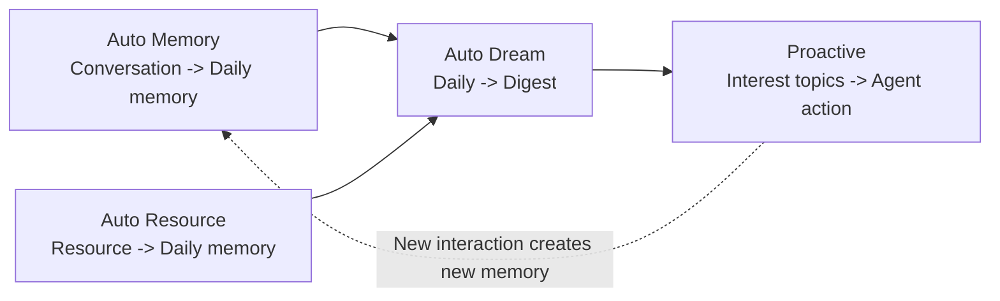

# Agent Memory Evolving & Proactive Interaction (Beta)

> **Beta Feature**: Agent Memory Evolving & Proactive Interaction is an experimental QwenPaw capability built around the new [ReMe](https://github.com/agentscope-ai/ReMe) memory architecture. The goal is to let an agent accumulate, refine, retrieve, and act on long-term memory without model fine-tuning. The implementation and product integration are still evolving; feedback is welcome on [GitHub](https://github.com/agentscope-ai/QwenPaw/issues).

QwenPaw uses ReMe as a file-native long-term memory layer. Conversations and resources are first saved as readable Markdown memory cards, then periodically distilled into durable digest memories. Proactive interaction is built on top of those memories: the agent can notice topics that deserve attention and decide whether to remind, follow up, or offer a useful next step.

---

## Core Idea

The new memory loop is centered on four capabilities:



| Phase              | Module        | What it does                                                                                                        | Main output                                     |
| ------------------ | ------------- | ------------------------------------------------------------------------------------------------------------------- | ----------------------------------------------- |
| **Accumulate**     | Auto Memory   | Turns useful conversation context into daily memory cards and keeps raw dialogue as traceable source material.      | `memory/<date>/<session_id>.md`                 |
| **Read Resources** | Auto Resource | Turns external files into daily resource cards linked back to the original resources.                               | `memory/<date>/<resource_card>.md`              |
| **Consolidate**    | Auto Dream    | Extracts long-term memory units from daily notes, integrates them into digest nodes, and generates interest topics. | `digest/*/*.md`, `memory/<date>/interests.yaml` |
| **Serve**          | Proactive     | Reads interest topics and exposes them to the upper-level agent, which decides whether and how to remind the user.  | Structured proactive topics                     |

This makes memory evolution a data flow rather than a single summary file: raw sessions and resources stay available, daily cards preserve what happened, digest nodes hold reusable knowledge, and proactive topics provide the bridge from memory to action.

---

## Memory as Files

ReMe stores memory directly in a workspace. Files are readable and editable by both users and agents, with frontmatter and wikilinks used for metadata and relationships.

```text
<workspace>/
├── mem_metadata/   # Indexes, graph data, catalogs, and persistent system state
├── mem_session/    # Raw conversations and agent sessions
│   └── dialog/
│       └── <session_id>.jsonl
├── resource/       # External source materials, grouped by date
│   └── YYYY-MM-DD/
│       └── <resource>.<ext>
├── memory/         # Lightly processed daily memory cards and day indexes
│   ├── YYYY-MM-DD.md
│   └── YYYY-MM-DD/
│       ├── <session_id>.md
│       ├── <resource_card>.md
│       └── interests.yaml
└── digest/         # Long-term memory nodes
    ├── personal/
    ├── procedure/
    └── wiki/
```

The split is intentional:

- `mem_session/` and `resource/` keep the original evidence.
- `memory/` keeps concise, human-readable records for a specific day.
- `digest/` keeps reusable long-term memory such as preferences, workflows, and knowledge.
- `mem_metadata/` keeps indexes for search, wikilink traversal, and incremental processing.

---

## Auto Memory

Auto Memory is the conversation entry point. It saves the original dialogue and turns long-term valuable information into a daily memory card.

```text
Conversation messages
  -> mem_session/dialog/<session_id>.jsonl
  -> memory/<date>/<session_id>.md
  -> memory/<date>.md
```

It records information that is likely to help future work:

| Type                | Examples                                                            |
| ------------------- | ------------------------------------------------------------------- |
| User preferences    | Language style, collaboration habits, recurring constraints         |
| Key facts           | Project background, important numbers, confirmed decisions          |
| Process decisions   | What was tried, why a route was chosen, which options were rejected |
| Current state       | What is done, what is blocked, what should happen next              |
| Reusable experience | Commands, debugging paths, workflows, lessons learned               |

Auto Memory does not try to rewrite the whole long-term knowledge base directly. Its job is to create a trustworthy daily layer. Later, Auto Dream decides what deserves to become durable digest memory.

Typical integration:

| Trigger                     | Purpose                                                              |
| --------------------------- | -------------------------------------------------------------------- |
| After-reply hook            | Capture useful conversation results while the session is still fresh |
| Session-end or compact hook | Preserve important context before it is lost                         |
| On-demand call              | Let an agent explicitly save a memory-relevant interaction           |

---

## Auto Resource

Auto Resource is the resource entry point. It watches or receives changes under `resource/<date>/`, reads the source files, and creates daily resource cards.

```text
resource/<date>/<resource_file>
  -> memory/<date>/<generated_name>.md
  -> source_resource: [[resource/<date>/<resource_file>]]
  -> memory/<date>.md
```

It is designed for making files useful to memory, not just storing them. A resource card may capture:

- the core content of the file;
- its structure, fields, sections, and tables;
- important names, dates, numbers, and conclusions;
- why the material matters to the current work;
- follow-up actions or deadlines.

When a resource changes, Auto Resource updates the linked daily card through `source_resource`. When a resource is deleted, the corresponding daily note can be cleaned up. The original file remains in `resource/`, so the memory card stays traceable.

Current ReMe Beta behavior is most suitable for text-like resources such as Markdown, text, JSON, JSONL, CSV, YAML, and HTML.

---

## Auto Dream

Auto Dream is the self-evolution step. It reads changed daily inputs for a date, extracts long-term memory units, integrates them into `digest/`, and writes proactive topic candidates into `interests.yaml`.

```text
memory/<date>.md
memory/<date>/**/*.md
  -> extract memory units and topic candidates
  -> integrate memory units into digest/
  -> write memory/<date>/interests.yaml
```

Digest memory is organized by memory type:

| Digest bucket | What belongs there                                           | Evolution role          |
| ------------- | ------------------------------------------------------------ | ----------------------- |
| `personal/`   | User preferences, long-term facts, collaboration constraints | Personalization         |
| `procedure/`  | Workflows, runbooks, debugging methods, lessons learned      | Reusable task execution |
| `wiki/`       | Domain knowledge, concepts, observations, decisions          | Knowledge base          |

Auto Dream uses four stages:

| Stage     | Responsibility                                                                                                             |
| --------- | -------------------------------------------------------------------------------------------------------------------------- |
| Extract   | Refresh the day index, compare daily files with the dream catalog, and extract changed memory units plus topic candidates. |
| Integrate | Search related digest nodes, then create, corroborate, refine, or correct one digest node per memory unit.                 |
| Topics    | De-duplicate and select the day's actionable interest topics, avoiding repeated topics from recent days.                   |
| Finish    | Checkpoint successfully processed files and return a summary of scanned, changed, integrated, and topic counts.            |

The integration step is where memory self-evolution happens. A new unit may create a new digest node, strengthen an existing one, refine its conditions and steps, or correct outdated information. Sources are linked back with workspace-relative wikilinks such as `derived_from:: [[memory/<date>/<session>.md]]`.

Auto Dream does not rewrite daily notes. Daily memory remains the factual record; digest memory is the abstract, reusable layer.

---

## Proactive

Proactive is the reading interface for active assistance. It does not re-analyze daily files and does not call an LLM by itself. It reads:

```text
memory/<date>/interests.yaml
```

The file is generated by Auto Dream's Topics stage. A typical topic contains a title, reason, evidence, keywords, and source paths. QwenPaw can use these topics to decide whether to:

- remind the user about an unfinished or time-sensitive item;
- follow up on a topic the user repeatedly cared about;
- suggest a next step for an ongoing project;
- retrieve fresh information before sending a proactive message.

The boundary is important: ReMe exposes what may be worth attention; QwenPaw decides whether to interrupt the user, when to do it, and how to phrase the message.

If `interests.yaml` does not exist, Proactive treats it as a normal empty state. This usually means Auto Dream has not produced topics for that date yet.

---

## Search and Reuse

ReMe maintains indexes in the background so agents can reuse memory by search and graph traversal. The indexer watches Markdown, JSONL, and resource changes, then updates:

- chunk indexes for file content;
- BM25 keyword indexes;
- embedding indexes for semantic recall;
- wikilink graph indexes for relationship expansion.

Retrieval can combine keyword matching, vector recall, and reciprocal-rank fusion. In QwenPaw, this means the agent can search both recent daily context and long-term digest memory instead of relying only on whatever is currently in the prompt.

---

## Recommended Mental Model

Use the memory loop this way:

| Step | Action                                        | Result                                                             |
| ---- | --------------------------------------------- | ------------------------------------------------------------------ |
| 1    | Let Auto Memory capture useful conversations. | The agent remembers what happened and why it mattered.             |
| 2    | Put useful files under the resource flow.     | External materials become searchable daily memory.                 |
| 3    | Let Auto Dream run regularly.                 | Daily records become durable personal, procedure, and wiki memory. |
| 4    | Let Proactive read `interests.yaml`.          | The agent can surface timely, memory-grounded follow-ups.          |

> **One-line summary**: save conversations and resources as daily evidence, distill durable knowledge into digest nodes, then use interest topics to drive proactive assistance.

---

## Current Status

This document reflects the new ReMe file-native design used for QwenPaw's next memory-evolution integration. Compared with the earlier ReMeLight design, the main changes are:

- memory is no longer centered on one `MEMORY.md` file;
- resources are first-class memory inputs through Auto Resource;
- long-term memory is split into `personal`, `procedure`, and `wiki` digest nodes;
- proactive behavior is driven by `memory/<date>/interests.yaml` generated by Auto Dream;
- search and wikilinks are part of the memory substrate rather than an optional add-on.

The feature remains Beta, and exact UI switches, schedules, and product defaults may continue to change as QwenPaw integrates the new ReMe runtime.
