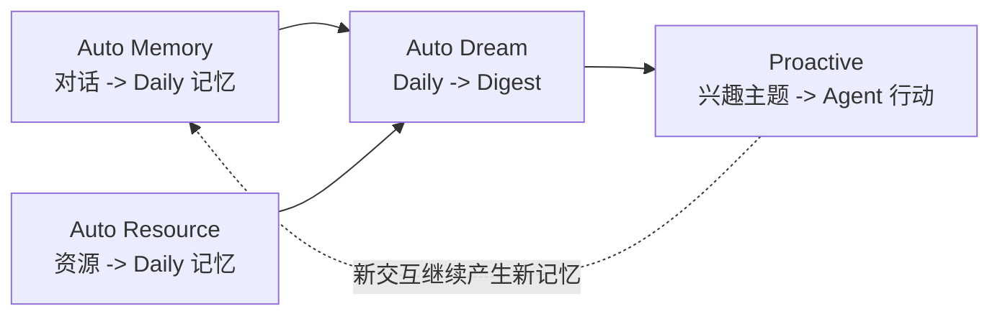

# 智能体记忆进化与主动交互（Beta）

> **Beta 功能**：智能体记忆进化与主动交互是 QwenPaw 基于新版 [ReMe](https://github.com/agentscope-ai/ReMe) 记忆架构建设的实验性能力。目标是在不微调模型的情况下，让 Agent 能够积累、整理、检索并主动使用长期记忆。当前实现和产品集成仍在持续迭代，如果你有建议，欢迎在 [GitHub](https://github.com/agentscope-ai/QwenPaw/issues) 反馈。

QwenPaw 使用 ReMe 作为文件化长期记忆层。对话和资源会先被保存为可读、可编辑、可追溯的 Markdown 记忆卡片，再定期沉淀为长期 digest 记忆。主动交互建立在这些记忆之上：Agent 可以发现值得关注的主题，并决定是否提醒、追问或给出下一步建议。

---

## 核心思路

新版记忆进化围绕四个能力形成闭环：



| 阶段       | 模块          | 做什么                                                              | 主要产物                                        |
| ---------- | ------------- | ------------------------------------------------------------------- | ----------------------------------------------- |
| **积累**   | Auto Memory   | 将有长期价值的对话上下文整理成 daily 记忆卡片，并保留原始对话来源。 | `memory/<date>/<session_id>.md`                 |
| **读资源** | Auto Resource | 将外部文件解读成 daily 资源卡片，并链接回原始资源。                 | `memory/<date>/<resource_card>.md`              |
| **沉淀**   | Auto Dream    | 从 daily 记忆中抽取长期记忆单元，整合进 digest，并生成兴趣主题。    | `digest/*/*.md`、`memory/<date>/interests.yaml` |
| **服务**   | Proactive     | 读取兴趣主题并暴露给上层 Agent，由 Agent 决定是否以及如何提醒用户。 | 结构化主动主题                                  |

因此，记忆进化不再是写入一个单独的总结文件，而是一条文件化数据流：原始会话和资源保留证据，daily 卡片记录当天发生了什么，digest 节点保存可复用知识，proactive 主题把记忆转化为行动线索。

---

## Memory as Files

ReMe 直接在 workspace 中存储记忆。文件对用户和 Agent 都可读、可编辑，frontmatter 和 wikilink 用来表达元数据与关系。

```text
<workspace>/
├── mem_metadata/   # 索引、图谱、catalog 和持久化系统状态
├── mem_session/    # 原始对话和 Agent session
│   └── dialog/
│       └── <session_id>.jsonl
├── resource/       # 外部原始资料，按日期组织
│   └── YYYY-MM-DD/
│       └── <resource>.<ext>
├── memory/         # 浅加工的日记卡片和当天索引
│   ├── YYYY-MM-DD.md
│   └── YYYY-MM-DD/
│       ├── <session_id>.md
│       ├── <resource_card>.md
│       └── interests.yaml
└── digest/         # 长期记忆节点
    ├── personal/
    ├── procedure/
    └── wiki/
```

这个分层有明确边界：

- `mem_session/` 和 `resource/` 保留原始证据；
- `memory/` 保留当天发生过什么，内容简洁、可读、可追溯；
- `digest/` 保留可复用的长期记忆，例如偏好、流程和知识；
- `mem_metadata/` 保留搜索、wikilink 图谱和增量处理需要的索引状态。

---

## Auto Memory

Auto Memory 是对话记忆入口。它保存原始对话，并将有长期价值的信息整理成 daily 记忆卡片。

```text
Conversation messages
  -> mem_session/dialog/<session_id>.jsonl
  -> memory/<date>/<session_id>.md
  -> memory/<date>.md
```

它会记录未来可能还会用到的信息：

| 类型       | 示例                                     |
| ---------- | ---------------------------------------- |
| 用户偏好   | 语言风格、协作习惯、长期约束             |
| 关键事实   | 项目背景、重要数字、明确决策             |
| 过程决定   | 尝试过什么、为什么这样选、哪些方案被放弃 |
| 当前状态   | 做到哪一步、卡在哪里、下一步是什么       |
| 可复用经验 | 命令、排查路径、工作流、经验教训         |

Auto Memory 不直接重写整个长期知识库。它的职责是建立可信的 daily 层；之后由 Auto Dream 判断哪些内容值得成为长期 digest 记忆。

典型触发方式：

| 触发方式                    | 目的                                |
| --------------------------- | ----------------------------------- |
| after-reply hook            | 在会话上下文仍然新鲜时沉淀有用结果  |
| session-end 或 compact hook | 在上下文丢失或压缩前保存重要信息    |
| 按需调用                    | 让 Agent 显式保存某次值得记忆的交互 |

---

## Auto Resource

Auto Resource 是资源记忆入口。它监听或接收 `resource/<date>/` 下的变化，读取原始文件，并生成 daily 资源卡片。

```text
resource/<date>/<resource_file>
  -> memory/<date>/<generated_name>.md
  -> source_resource: [[resource/<date>/<resource_file>]]
  -> memory/<date>.md
```

它的目标不是简单存档文件，而是让资料变成可用记忆。资源卡片通常会提炼：

- 文件的核心内容；
- 章节、字段、表格等结构；
- 重要名称、日期、数字和结论；
- 这份资料与当前工作的关系；
- 后续行动项或截止时间。

资源更新时，Auto Resource 会通过 `source_resource` 找到对应 daily 卡片并更新；资源删除时，也可以清理对应 daily note。原始文件仍然保留在 `resource/` 中，因此每张资源卡片都能追溯来源。

当前 ReMe Beta 更适合处理文本类资源，例如 Markdown、text、JSON、JSONL、CSV、YAML 和 HTML。

---

## Auto Dream

Auto Dream 是记忆自进化步骤。它读取某一天发生变化的 daily 输入，抽取长期记忆单元，整合进 `digest/`，并把主动主题候选写入 `interests.yaml`。

```text
memory/<date>.md
memory/<date>/**/*.md
  -> 抽取 memory units 和 topic candidates
  -> 整合 memory units 到 digest/
  -> 写入 memory/<date>/interests.yaml
```

Digest 记忆按类型组织：

| Digest bucket | 存什么                              | 进化作用       |
| ------------- | ----------------------------------- | -------------- |
| `personal/`   | 用户偏好、长期事实、协作约束        | 个性化         |
| `procedure/`  | 工作流、runbook、排查方法、经验教训 | 可复用任务执行 |
| `wiki/`       | 领域知识、概念、观察、决策先例      | 知识库         |

Auto Dream 包含四个阶段：

| 阶段      | 职责                                                                                                 |
| --------- | ---------------------------------------------------------------------------------------------------- |
| Extract   | 刷新当天索引，对比 daily 文件和 dream catalog，只从变化文件中抽取 memory units 与 topic candidates。 |
| Integrate | 搜索相关 digest 节点，并对每个 memory unit 执行创建、佐证、细化或纠错。                              |
| Topics    | 对当天兴趣主题去重、筛选，并避免和最近几天的主题重复。                                               |
| Finish    | 对成功处理的文件做 checkpoint，并返回 scanned、changed、integrated、topics 等摘要。                  |

真正的记忆自进化发生在 Integrate 阶段：新的 unit 可能创建新 digest 节点，也可能强化已有节点、细化适用条件和步骤，或修正过时信息。来源通过 workspace-relative wikilink 追溯，例如 `derived_from:: [[memory/<date>/<session>.md]]`。

Auto Dream 不改写 daily 正文。daily 是事实和现场记录，digest 才是抽象后的长期记忆层。

---

## Proactive

Proactive 是主动服务的读取接口。它本身不重新分析 daily 文件，也不调用 LLM，只读取：

```text
memory/<date>/interests.yaml
```

该文件由 Auto Dream 的 Topics 阶段生成。一个典型 topic 会包含标题、原因、证据、关键词和来源路径。QwenPaw 可以基于这些 topic 决定是否：

- 提醒用户某个未完成或有时效性的事项；
- 跟进用户近期反复关注的话题；
- 为正在进行的项目建议下一步；
- 在主动消息前检索最新信息。

这里的边界很重要：ReMe 负责暴露“今天可能值得关注什么”，QwenPaw 负责判断是否打扰用户、什么时候打扰，以及用什么方式表达。

如果 `interests.yaml` 不存在，Proactive 会把它视为正常空状态。通常这表示当天还没有 Auto Dream 结果。

---

## 搜索与复用

ReMe 会在后台维护索引，让 Agent 可以通过搜索和图谱关系复用记忆。索引器会监听 Markdown、JSONL 和资源变化，并更新：

- 文件内容的 chunk 索引；
- BM25 关键词索引；
- embedding 语义召回索引；
- wikilink 图谱索引。

检索可以结合关键词匹配、向量召回和 RRF 融合。在 QwenPaw 中，这意味着 Agent 不只能依赖当前 prompt，也可以搜索近期 daily 上下文和长期 digest 记忆。

---

## 推荐理解方式

可以这样理解和使用整条记忆链路：

| 步骤 | 动作                                 | 结果                                                           |
| ---- | ------------------------------------ | -------------------------------------------------------------- |
| 1    | 让 Auto Memory 捕获有价值的对话。    | Agent 记住发生了什么，以及为什么重要。                         |
| 2    | 让有用文件进入 resource 流程。       | 外部资料变成可搜索的 daily 记忆。                              |
| 3    | 让 Auto Dream 定期运行。             | Daily 记录沉淀为 durable 的 personal、procedure 和 wiki 记忆。 |
| 4    | 让 Proactive 读取 `interests.yaml`。 | Agent 可以基于记忆给出及时的后续提醒或建议。                   |

> **一句话总结**：对话和资源先成为 daily 证据，长期价值再沉淀进 digest 节点，最后由兴趣主题驱动主动服务。

---

## 当前状态

本文档反映的是 QwenPaw 记忆进化下一阶段集成的新版 ReMe 文件化设计。相比早期 ReMeLight 方案，主要变化是：

- 记忆不再围绕单个 `MEMORY.md` 文件组织；
- 资源通过 Auto Resource 成为一等记忆输入；
- 长期记忆拆分为 `personal`、`procedure`、`wiki` 三类 digest 节点；
- 主动服务由 Auto Dream 生成的 `memory/<date>/interests.yaml` 驱动；
- 搜索和 wikilink 是记忆底座的一部分，而不是额外附加能力。

该能力仍处于 Beta 阶段。随着 QwenPaw 接入新版 ReMe runtime，具体 UI 开关、调度时间和产品默认值可能继续调整。
