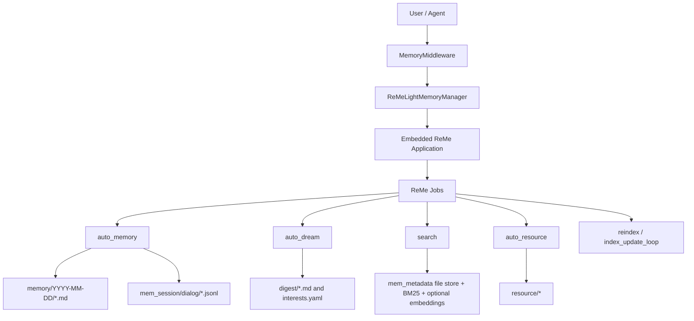
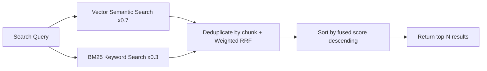

# Long-term Memory

**Long-term Memory** gives QwenPaw persistent memory across conversations. In the default backend, QwenPaw embeds the
ReMe application in-process and runs ReMe jobs to save conversation facts, build daily notes, extract digest memories,
watch resource files, and search the memory vault.

> The long-term memory mechanism is inspired by [OpenClaw](https://github.com/openclaw/openclaw) and implemented via **ReMeLight** from [ReMe](https://github.com/agentscope-ai/ReMe) — a file-based memory backend where memories are plain Markdown files that can be read, edited, and migrated directly.

---

## Architecture Overview



Long-term memory management includes the following capabilities:

| Capability             | Description                                                                                                      |
| ---------------------- | ---------------------------------------------------------------------------------------------------------------- |
| **Embedded ReMe app**  | QwenPaw starts ReMe in-process and injects the active QwenPaw model into ReMe's default LLM component            |
| **Auto-Memory**        | After a configurable number of user turns, ReMe extracts useful conversation facts into daily Markdown notes     |
| **Context compaction** | Before context compression, pending turns can be flushed into the same `auto_memory` pipeline                    |
| **Auto-Dream**         | A cron job extracts higher-level digest units and proactive-interest topics from recent daily notes              |
| **Hybrid Search**      | `memory_search` calls ReMe's `search` job, using BM25 plus optional vector search and reciprocal-rank fusion     |
| **Resource Memory**    | Files under `resource/` are cataloged and can be interpreted into source-linked daily notes                      |
| **Inbox Results**      | `auto_memory`, `auto_dream`, and `auto_resource` results are pushed to QwenPaw's inbox when they produce changes |

---

## Memory File Structure

Memories are stored as plain files under the agent workspace. ReMe's Markdown files are the readable source of memory,
while `mem_metadata/` stores search indexes, catalogs, graphs, and embedding caches.

```
{workspace}/
├── memory/                         ← Daily memory notes
│   └── 2026-06-29/
│       ├── project-plan.md          ← One note written/updated by auto_memory
│       └── index.md                 ← Day index generated from the day's notes
│
├── mem_session/
│   └── dialog/
│       └── <session_id>.jsonl       ← Sanitized conversation history used as note source
│
├── digest/                         ← Auto-Dream digest memory and interest topics
├── resource/                       ← External assets watched by auto_resource
└── mem_metadata/                   ← ReMe persistent indexes and catalogs
```

### memory/YYYY-MM-DD/\*.md (Daily Notes)

Daily notes are the default Auto-Memory output. ReMe writes one or more notes per day, keyed by the source conversation
session. Each note includes frontmatter such as `session_id` and `source_conversation`, so later updates can find and
modify the existing note instead of creating duplicates.

- **Location**: `{working_dir}/memory/YYYY-MM-DD/*.md`
- **Purpose**: Stores durable conversation facts, decisions, preferences, and work notes
- **Updates**: ReMe `auto_memory` creates or edits notes using ReMe file jobs such as `daily_write`, `read`, `edit`,
  `frontmatter_update`, and `write`
- **Index**: After each successful write, ReMe refreshes the day's `index.md`

### mem_session/dialog/\*.jsonl (Conversation Source)

Before extracting memory, ReMe saves the relevant messages into a session log. Tool-result blocks and base64 data blocks
are stripped so recalled memory or large media cannot be mistaken for user-provided facts in future extraction runs.

- **Location**: `{working_dir}/mem_session/dialog/<session_id>.jsonl` by default
- **Purpose**: Source traceability for daily notes
- **Linking**: Daily-note frontmatter links back to the source conversation with `[[mem_session/dialog/<session_id>.jsonl]]`

### digest/ (Dream Memory)

Auto-Dream reads recent daily notes, extracts merged digest units, updates the dream catalog, and writes user-interest
topics for proactive use.

- **Location**: `{working_dir}/digest/`
- **Purpose**: Higher-level, cross-session memory and proactive-interest topics
- **Updates**: ReMe `auto_dream`, usually triggered by `dream_cron`

### resource/ (Resource Memory)

Files placed under `resource/` are watched and cataloged. When supported files change, ReMe can interpret them into
source-linked daily notes via `auto_resource`.

- **Location**: `{working_dir}/resource/`
- **Supported default suffixes**: `md`, `txt`, `json`, `jsonl`, `csv`, `yaml`, `html`
- **Inbox behavior**: Resource processing results are pushed to the inbox only when memory changed

> For a complete walkthrough of Auto-Memory, Auto-Dream, Auto-Memory-Search, and Proactive, see [Memory-Evolving & Proactive Interaction](./memory-evolving-and-proactive). The sections below cover technical implementation details and configuration only.

---

## Searching Memory

The Agent has two ways to retrieve past memories:

| Method        | Tool            | Use Case                                                    | Example                                        |
| ------------- | --------------- | ----------------------------------------------------------- | ---------------------------------------------- |
| Hybrid search | `memory_search` | Unsure which file contains the info; fuzzy recall by intent | "Previous discussion about deployment process" |
| Direct read   | File tools      | Known specific date or file path; precise lookup            | Read `memory/2026-06-29/project-plan.md`       |

### Hybrid Search Explained

`memory_search` calls ReMe's `search` job. Search always tries keyword retrieval through BM25 and also runs vector
retrieval when an embedding model is configured. When both paths return results, ReMe fuses the ranked lists with
**Reciprocal Rank Fusion (RRF)**.

#### Vector Semantic Search

Maps text into a high-dimensional vector space and measures semantic distance via cosine similarity, capturing content
with similar meaning but different wording:

| Query                                   | Recalled Memory                                           | Why It Matches                                                  |
| --------------------------------------- | --------------------------------------------------------- | --------------------------------------------------------------- |
| "Database choice for the project"       | "Finally decided to replace MySQL with PostgreSQL"        | Semantically related: both discuss database technology choices  |
| "How to reduce unnecessary rebuilds"    | "Configured incremental compilation to avoid full builds" | Semantic equivalence: reduce rebuilds ≈ incremental compilation |
| "Performance issue discussed last time" | "Optimized P99 latency from 800ms to 200ms"               | Semantic association: performance issue ≈ latency optimization  |

However, vector search is weaker on **precise, high-signal tokens**, as embedding models tend to capture overall
semantics rather than exact matches of individual tokens.

#### BM25 Keyword Search

Based on term frequency statistics for substring matching, excellent for precise token hits, but weaker on semantic
understanding (synonyms, paraphrasing).

| Query                      | BM25 Hits                                      | BM25 Misses                                           |
| -------------------------- | ---------------------------------------------- | ----------------------------------------------------- |
| `handleWebSocketReconnect` | Memory fragments containing that function name | "WebSocket disconnection reconnection handling logic" |
| `ECONNREFUSED`             | Log entries containing that error code         | "Database connection refused"                         |

ReMe maintains a local BM25 index over indexed files. This gives reliable hits for exact identifiers, error codes,
filenames, and uncommon words even when embeddings are unavailable.

#### Hybrid Search Fusion

When both vector and BM25 return candidates, ReMe uses weighted RRF. The default vector weight is `0.7`; the remaining
`0.3` goes to keyword search.

1. **Expand candidate pool**: Multiply the desired result count by `candidate_multiplier` (default 3×, capped at 200);
   each path retrieves more candidates independently
2. **Independent ranking**: Vector and BM25 each return ranked result lists
3. **RRF merging**: Deduplicate by chunk id and add rank-based contributions:
   - Vector contribution: `0.7 / (60 + vector_rank)`
   - Keyword contribution: `0.3 / (60 + keyword_rank)`
   - Chunks found by both paths receive both contributions
4. **Sort and truncate**: Sort by `final_score` descending, return top-N results
5. **Link expansion**: Search can include nearby linked files to provide additional context

**Example**: Query `"handleWebSocketReconnect disconnection reconnect"`

| Memory Fragment                                                               | Vector Rank | BM25 Rank | Why It Ranks Well                                   |
| ----------------------------------------------------------------------------- | ----------- | --------- | --------------------------------------------------- |
| "handleWebSocketReconnect function handles WebSocket disconnection reconnect" | 2           | 1         | Strong semantic match plus exact keyword hit        |
| "Logic for automatic retry after network disconnection"                       | 1           | -         | Strong semantic match even without exact identifier |
| "Fixed null pointer exception in handleWebSocketReconnect"                    | -           | 2         | Exact identifier hit keeps it in the candidate set  |



> **Summary**: Using any single search method alone has blind spots. Hybrid search lets the two signals complement each
> other, delivering reliable recall whether you're asking in natural language or searching for exact terms.

---

## Backup & Restore

Backup & Restore is QwenPaw's backup and recovery capability, enabling safe saving and restoration of the entire agent environment for scenarios like version upgrades, cross-device migration, or undoing mistakes. Access: Console → Settings → Backup.

### Creating Backups

**Backup Storage**

All backups are saved as independent zip packages in `~/.qwenpaw/backups` (alongside the working directory `~/.qwenpaw`). Each backup contains `meta.json` metadata and packaged content files. The zip file is exported for easy migration. Note that backups do not include local model files; re-download is required for cross-device migration.

**Backup Scope**

- **Agent workspaces**: Selectable per Agent
- **Global settings**: `config.json` and other global configurations
- **Skill pool**: Shared skills directory
- **Secrets**: Model API Keys, environment variables, etc.

**Backup Modes**

- **Full backup**: One-click package of all the above content
- **Partial backup**: Backup selected modules and specific agent workspaces

### Restoring Backups

**Restore Modes**

- **Full restore**: Completely replaces the current instance with the backup — current content is deleted and replaced with backup content. Requires the backup to contain all modules (agent workspaces, global settings, skill pool, secrets).
- **Custom restore**: Restore by module or by Agent with fine-grained control. Local Agents not included in the restore scope remain unchanged.

**Pre-restore Prompt**

Before restoring, the system prompts to create a snapshot of the current state. If the restore goes wrong, you can roll back with one click.

**Notes**

- Backup files may contain sensitive credentials — store them safely and do not share with others
- Service restart is required after restore for new configuration to take effect

---

## Memory Configuration

### Configuration Structure

Memory configuration is located in `agent.json` under `running.reme_light_memory_config`:

| Field                           | Description                                                                    | Default          |
| ------------------------------- | ------------------------------------------------------------------------------ | ---------------- |
| `metadata_dir`                  | ReMe persistent state directory for indexes, catalogs, graph data, and caches  | `"mem_metadata"` |
| `session_dir`                   | Directory for saved source conversations                                       | `"mem_session"`  |
| `resource_dir`                  | Directory watched by `auto_resource`                                           | `"resource"`     |
| `daily_dir`                     | Directory for daily memory notes                                               | `"memory"`       |
| `digest_dir`                    | Directory for dream/digest memory                                              | `"digest"`       |
| `enable_search_raw_log`         | Whether search also indexes raw session/resource JSONL-style data              | `false`          |
| `summarize_when_compact`        | Whether pending turns are flushed to Auto-Memory before context compression    | `true`           |
| `auto_memory_interval`          | Auto-Memory every N user turns. `None` or `<= 0` disables periodic Auto-Memory | `5`              |
| `dream_cron`                    | Cron expression for the Auto-Dream job (empty string disables it)              | `"0 23 * * *"`   |
| `rebuild_memory_index_on_start` | Whether to clear and rebuild the ReMe search index on agent startup            | `false`          |

### Auto Memory Search Configuration

Configure in `running.reme_light_memory_config.auto_memory_search_config`:

| Field                | Description                                                                       | Default |
| -------------------- | --------------------------------------------------------------------------------- | ------- |
| `enabled`            | Whether to auto search memory on every conversation turn                          | `false` |
| `max_results`        | Maximum results for auto memory search                                            | `2`     |
| `persist_to_context` | Whether the injected auto-search tool call/result is kept in conversation context | `false` |

### Embedding Configuration (Optional)

Embedding configuration for vector semantic search, located in `running.reme_light_memory_config.embedding_model_config`:

| Field              | Description                                  | Default  |
| ------------------ | -------------------------------------------- | -------- |
| `backend`          | Embedding backend type                       | `openai` |
| `api_key`          | API Key for the Embedding service            | ``       |
| `base_url`         | URL of the Embedding service                 | ``       |
| `model_name`       | Embedding model name                         | ``       |
| `dimensions`       | Vector dimensions for initializing vector DB | `1024`   |
| `enable_cache`     | Whether to enable Embedding cache            | `true`   |
| `use_dimensions`   | Whether to pass dimensions parameter in API  | `false`  |
| `max_cache_size`   | Maximum Embedding cache entries              | `10000`  |
| `max_input_length` | Maximum input length per Embedding request   | `8192`   |
| `max_batch_size`   | Maximum batch size for Embedding requests    | `10`     |

> `use_dimensions` is for cases where some vLLM models don't support the dimensions parameter. Set to `false` to skip it.

> `base_url` and `model_name` must both be non-empty to enable vector search in hybrid retrieval (`api_key` is not required).

### Indexing Behavior

The embedded ReMe configuration uses a local file store with:

| Component        | Behavior                                                                                       |
| ---------------- | ---------------------------------------------------------------------------------------------- |
| File store       | Local ReMe file store under `mem_metadata/`                                                    |
| Keyword index    | BM25 keyword index enabled by default                                                          |
| Vector index     | Enabled only when both `embedding_model_config.base_url` and `model_name` are set              |
| Watched dirs     | `daily_dir` and `digest_dir`; `resource_dir` is also indexed when `enable_search_raw_log=true` |
| Watched suffixes | `md` by default; `jsonl` is included when raw-log search is enabled                            |

---

## Other Memory Backends

QwenPaw's memory system uses a pluggable backend architecture. In addition to the default ReMeLight (local file storage), you can switch to other backends via `memory_manager_backend`.

### ADBPG (AnalyticDB for PostgreSQL)

A long-term memory backend backed by a cloud vector database. Suitable for scenarios that need cross-device sharing or large-scale semantic retrieval.

**Key features:**

- **Cross-session persistence** — Memories are stored in a cloud database, retained across restarts, and shareable across devices.
- **Server-side fact extraction** — Fact extraction is performed by the LLM built into ADBPG, with no extra client-side overhead.
- **Dual API modes** — Supports both direct SQL connection and REST API access.
- **Graceful degradation** — When ADBPG is unreachable, the agent keeps running normally; only the long-term memory feature is temporarily disabled.

**How to configure:**

Open the agent's "Running Config" tab in the Console, locate the "Memory Manager Backend" dropdown, choose `adbpg`, and fill in the parameters under `adbpg_memory_config` according to the API mode you select.


> ⚠️ Switching the backend does not support hot reload. After saving, restart QwenPaw for the change to take effect (the page also shows a yellow banner reminder).

#### REST Mode (Recommended)

Connect to the ADBPG memory service over HTTP API — no additional Python dependencies required.

Switch to the "ADBPG Long-term Memory" tab, set "API Mode" to `REST API`, and fill in `REST Base URL` and `REST API Key`:


| Field              | Description                                                     | Default  |
| ------------------ | --------------------------------------------------------------- | -------- |
| `api_mode`         | API mode, set to `"rest"`                                       | `"rest"` |
| `rest_base_url`    | REST API URL of the ADBPG memory service                        | `""`     |
| `rest_api_key`     | Access key for the REST API                                     | `""`     |
| `memory_isolation` | Memory isolation mode: `true` for per-agent, `false` for shared | `true`   |
| `search_timeout`   | Memory search timeout (seconds)                                 | `10.0`   |

#### SQL Mode

Connect directly to the ADBPG database via psycopg2. Requires installing an extra dependency: `pip install qwenpaw[adbpg]`.

Switch to the "ADBPG Long-term Memory" tab, set "API Mode" to `SQL (Direct)`, and fill in the database connection info (host / port / user / password / dbname) along with LLM and Embedding parameters:


| Field                | Description                                    | Default |
| -------------------- | ---------------------------------------------- | ------- |
| `api_mode`           | API mode, set to `"sql"`                       | `"sql"` |
| `host`               | ADBPG database host                            | `""`    |
| `port`               | Database port                                  | `5432`  |
| `user`               | Database user                                  | `""`    |
| `password`           | Database password                              | `""`    |
| `dbname`             | Database name                                  | `""`    |
| `llm_model`          | LLM model used for server-side fact extraction | `""`    |
| `llm_api_key`        | API Key for the LLM service                    | `""`    |
| `llm_base_url`       | Base URL of the LLM service                    | `""`    |
| `embedding_model`    | Embedding model name                           | `""`    |
| `embedding_api_key`  | API Key for the Embedding service              | `""`    |
| `embedding_base_url` | Base URL of the Embedding service              | `""`    |
| `embedding_dims`     | Vector dimensions                              | `1024`  |
| `memory_isolation`   | Memory isolation mode                          | `true`  |
| `search_timeout`     | Memory search timeout (seconds)                | `10.0`  |
| `pool_minconn`       | Minimum connections in the pool                | `1`     |
| `pool_maxconn`       | Maximum connections in the pool                | `5`     |

**Configuration example:**

The full configuration can be written into `running.adbpg_memory_config` of `agent.json`:

```json
{
  "running": {
    "memory_manager_backend": "adbpg",
    "adbpg_memory_config": {
      "host": "gp-xxxxxxxxx-master.gpdb.rds.aliyuncs.com",
      "port": 5432,
      "user": "your_db_user",
      "password": "your_db_password",
      "dbname": "your_db_name",
      "llm_model": "qwen-plus",
      "llm_api_key": "sk-xxxxxxxx",
      "llm_base_url": "https://dashscope.aliyuncs.com/compatible-mode/v1",
      "embedding_model": "text-embedding-v3",
      "embedding_api_key": "sk-xxxxxxxx",
      "embedding_base_url": "https://dashscope.aliyuncs.com/compatible-mode/v1",
      "embedding_dims": 1024,
      "api_mode": "sql",
      "rest_api_key": "",
      "rest_base_url": "",
      "memory_isolation": true,
      "search_timeout": 10.0,
      "pool_minconn": 1,
      "pool_maxconn": 5
    }
  }
}
```

> 💡 When you fill these fields in the Console "Running Config" page, the framework writes them into `agent.json` automatically — no need to edit the file by hand.

---

## Related Pages

- [Memory-Evolving & Proactive Interaction](./memory-evolving-and-proactive) — Auto-Memory, Auto-Dream, Auto-Memory-Search, Proactive complete workflow
- [Introduction](./intro) — What this project can do
- [Console](./console) — Manage memory and configuration in the console
- [Skills](./skills) — Built-in and custom capabilities
- [Configuration & Working Directory](./config) — Working directory and config
